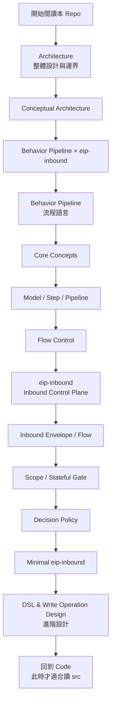

# 中文讀者閱讀路線指南



```text
閱讀順序不是依照模組重要性，
而是依照「心智模型建立的先後」。

Architecture 用來建立邊界，
Behavior Pipeline 用來理解流程語言，
eip-inbound 用來理解 Inbound 的控制與決策，
DSL 則是這些設計在語法層面的延伸。
```

本文件提供一條**理解本 repo 設計脈絡的閱讀路線**。  
這不是 API 教學，也不是「快速上手」，而是幫助你建立**正確的心智模型**。

如果你是第一次接觸本專案，請不要從程式碼或 DSL 範例開始。

---

## 閱讀前的心理準備

這個 repo 有幾個刻意的設計前提：

- 有些事情「做得到」，但被刻意設計成「不做」
- 有些抽象看起來嚴格，是為了防止責任混雜
- 不是所有邏輯都應該被流程或框架承擔

如果你期待的是「方便」或「自動化」，  
請先暫停，從設計邏輯理解開始。

---

## 第一階段：先建立整體畫面（必讀）

### 1️⃣ `docs/architecture/`

請先閱讀這個資料夾，而不是任何 DSL 說明。

建議順序：

1. **`conceptual-architecture-behavior-pipeline-eip-inbound.md`**  
   → 建立整體概念圖，理解 control plane 與 execution plane 的分離

2. **`behavior-pipeline-and-eip-inbound.md`**  
   → 理解為什麼拆成 behavior-pipeline 與 eip-inbound，以及它們如何協作

這一階段的目標只有一個：

> **知道每個模組「負責什麼、不負責什麼」。**

---

## 第二階段：理解流程語言（behavior-pipeline）

當你已經理解整體邊界，再進入流程語言本身。

閱讀路線：

1. `docs/behavior-pipeline/README.md`  
   → 理解 behavior-pipeline 的定位

2. `01-core-concept.md`  
   → Step、Context、Validation 的基本角色

3. `02-model.md`  
   → 核心模型如何被組織

4. `03-behavior-step.md`  
   → Step 的責任與組合方式

5. `04-pipeline.md`  
   → Pipeline 如何執行與傳遞狀態

6. `05-flow-control.md`  
   → 中斷、繼續、錯誤控制的語意

這一階段的重點是：

> **流程「怎麼跑」，但不包含「跑什麼業務」。**

---

## 第三階段：理解 Inbound 控制（eip-inbound）

接著再進入 Inbound 的語意層。

閱讀路線：

1. `docs/eip-inbound/README.md`  
   → Inbound control plane 的定位

2. `01-inbound-envelope.md`  
   → 為什麼需要 InboundEnvelope

3. `02-inbound-flow.md`  
   → Stateless 進場流程的角色

4. `03-scope-and-views.md`  
   → 決策為何需要 View 與 Scope

5. `04-stateful-gate.md`  
   → Stateful concern 為何集中在 Gate

6. `05-decision-policy.md`  
   → 為什麼決策必須是資料

7. `06-routing-and-split.md`  
   → Routing / Split 與 Decision 的區分

8. `08-minimal-eip-inbound.md`  
   → 回到最小模型，確認沒有誤解

這一階段的目標是：

> **理解「事件如何被對待」，而不是「事件如何被處理」。**

---

## 第四階段：DSL 與寫入設計（進階）

當你已經理解流程與控制邊界，再閱讀 DSL 設計會比較自然。

建議閱讀：

- `docs/write-operation-design/`
  - `0-motivation/`
  - `1-core/`
  - `2-composition/`
  - `3-boundaries/`

這一部分關注的是：

> **如何在 DSL 層面，維持與架構一致的責任邊界。**

---

## 閱讀順序總結（一行版）

如果只能記住一句話：

> **先 architecture，再流程，再 inbound，最後才看 DSL。**

---

## 常見卡關點（提醒）

- 看不懂不是因為你不會寫程式  
  → 通常是因為還沒建立邊界心智模型

- 覺得設計「太嚴格」  
  → 多半是因為少看了 architecture

- 想直接跳到 code  
  → 很容易誤會「為什麼這樣寫」

---

## 結語

這個 repo 不是為了「快速產出」，  
而是為了**讓行為、決策與責任能被清楚思考與討論**。

請慢慢讀，從結構開始。

---

> **當你理解「為什麼不能這樣寫」，  
> 你才真正理解了這套設計。**
