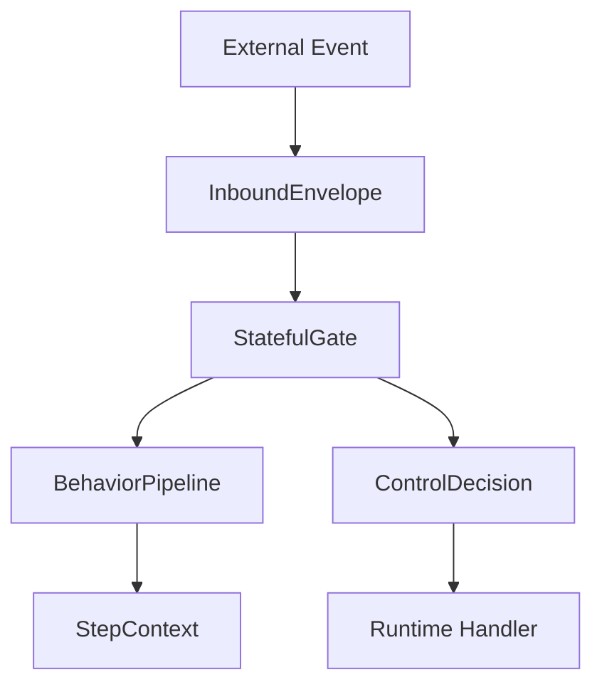
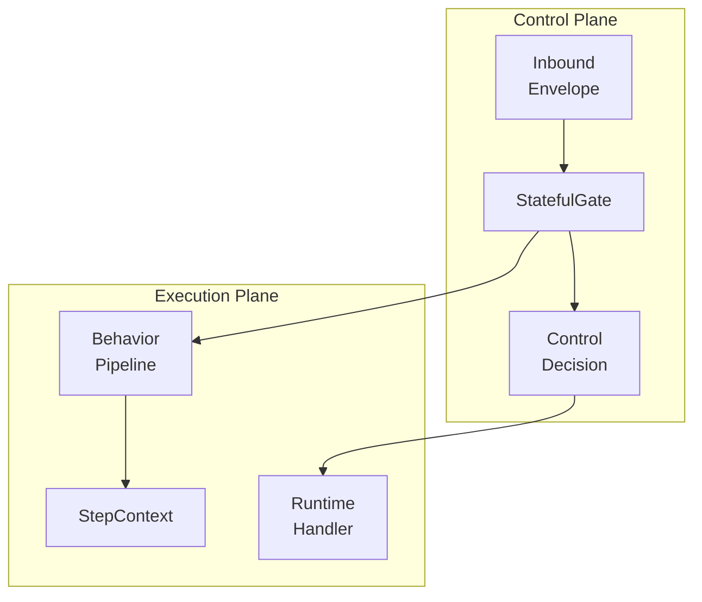

# `Mermaid：Behavior Pipeline × eip-inbound（Conceptual Architecture）`






## 圖例說明

```text
External World
  └─ 不可信的外部事件來源

eip-inbound (Inbound Control Plane)
  ├─ InboundEnvelope：統一輸入語意
  ├─ InboundFlow：stateless 進場流程
  ├─ StatefulGate：stateful concern 聚合
  └─ ControlDecision：顯式處置結果

behavior-pipeline (Process Execution Language)
  ├─ 定義流程如何執行
  ├─ StepContext 演進
  └─ 錯誤累積與中斷策略

Runtime / Handler
  └─ 根據 ControlDecision 執行 side-effect
```
