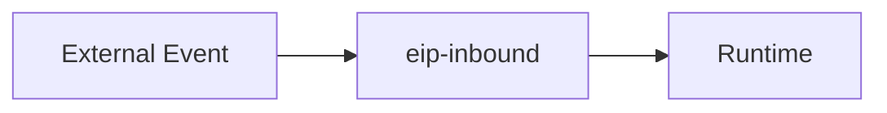
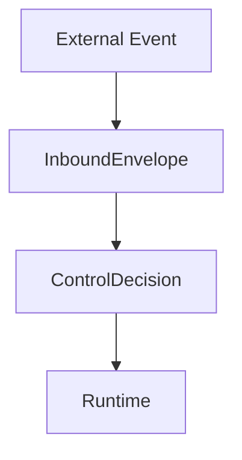

# `Minimal eip-inbound`（最小化設計說明）

本文件說明 **`eip-inbound` 的最小不可約設計**：  
在不引入流程細節、不暴露實作機制的前提下，`eip-inbound` 到底在做什麼。

---

## 一句話定義

> **`eip-inbound` 的唯一責任，是將外部事件轉換為可治理的處置決策。**

---

## 最小概念模型



> `eip-inbound` 將外部事件轉換為可執行的處置決策。

```text
External Event
      ↓
InboundEnvelope
      ↓
ControlDecision
      ↓
Runtime
```

這四個概念，構成 `eip-inbound` 的最小閉環。



---

## 四個不可省略的角色

### 1. External Event

代表任何來自系統外部的刺激，例如：

- `HTTP Request`
    
- `MQ / MQTT Message`
    
- `File / Batch`
    
- `Scheduled Trigger`
    

**特性：**

- 不可信
    
- 格式不一致
    
- 不具系統語意
    

---

### 2. `InboundEnvelope`

`InboundEnvelope` 是外部事件進入系統後的**第一層語意化結果**。

它的責任是：

- 統一外部輸入的結構
    
- 保留事件「發生過」的事實
    
- 切斷 transport 與後續流程的耦合
    

在最小模型中，你只需要知道：

> **沒有 `InboundEnvelope`，就沒有 Inbound 的語意邊界。**

---

### 3. `ControlDecision`

`ControlDecision` 是 `eip-inbound` 的**輸出核心**。

它不是動作，而是結果，用來回答：

> **這個事件，系統接下來要怎麼對待？**

典型的決策包含：

- `Ack`
    
- `Retry`（含時間資訊）
    
- `DLQ`
    
- `Noop`
    
- `FailInternal`
    

**關鍵原則：**

- 決策是資料
    
- 決策可被觀察、儲存、回放
    
- 決策本身不執行 side-effect
    

---

### 4. Runtime

Runtime 是**真正執行行為的一層**，例如：

- HTTP framework
    
- MQ client
    
- Scheduler
    
- File processor
    

Runtime 的責任非常單純：

> **根據 ControlDecision 執行對應的 side-effect。**

Runtime 不應：

- 重新判斷策略
    
- 推翻決策
    
- 引入隱性規則
    

---

## 為什麼這是「最小化」？

因為 `eip-inbound` 的所有其他設計，都是為了**讓這條最短路徑成立且可治理**：

- `InboundFlow`
    → 保證 Envelope 能穩定產生
    
- `StatefulGate` 
    → 為了正確產生 Decision
    
- `Scope / View` 
    → 為了讓 Decision 可推理
    
- `Failure / Status`  
    → 為了讓 Decision 有歷史與脈絡
    

但這些都不是**不可約核心**。

---

## 與 behavior-pipeline 的關係（最小說法）

- behavior-pipeline  
    → 定義「流程怎麼跑」
    
- eip-inbound  
    → 定義「事件怎麼被對待」
    

在最小模型中，你甚至可以只記住：

> **eip-inbound 不跑流程，只產生決策。**

---

## 常見誤解澄清

### ❌ eip-inbound 是 execution engine

→ 不，它不執行任何 side-effect

### ❌ eip-inbound 是 workflow

→ 不，它不描述業務流程

### ❌ eip-inbound 是 retry framework

→ 不，它只描述 retry 的決策結果

---

## 設計哲學總結

- Inbound 是控制問題，不是執行問題
    
- 決策必須顯式化，否則不可治理
    
- 越靠近邊界，模型越應該簡單
    

---

> **如果一個系統無法清楚說明「事件接下來會怎樣」，  
> 那它實際上也無法被真正控制。**