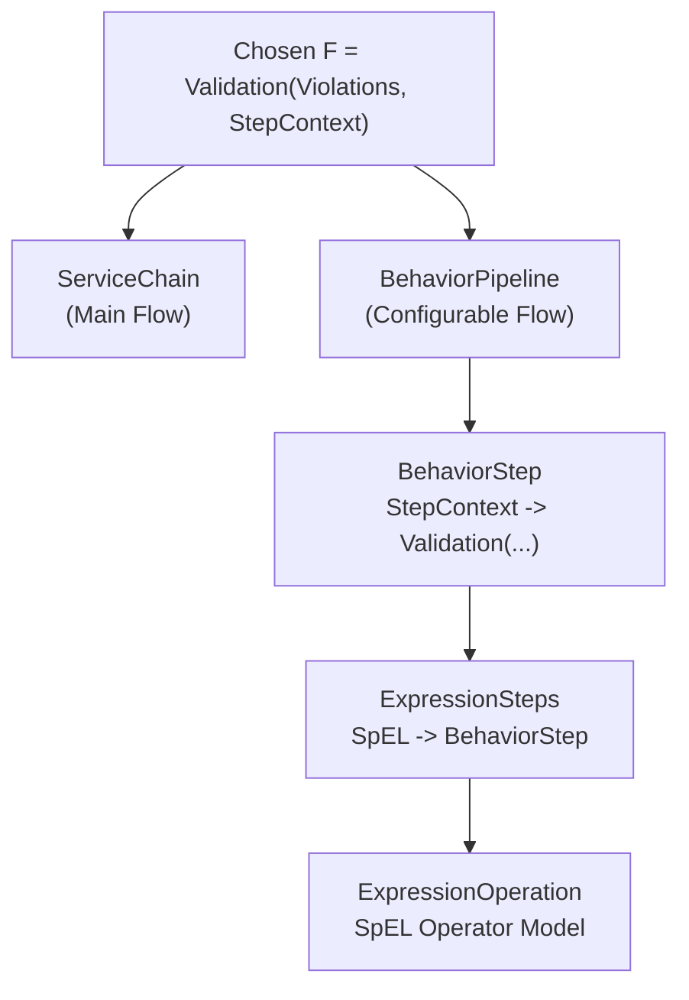
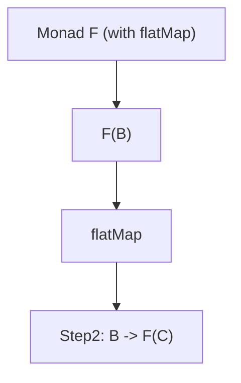
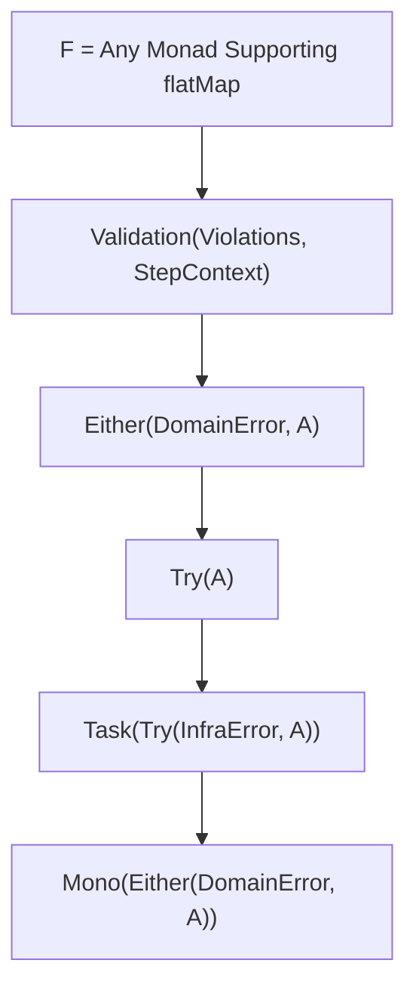

# 📘 `ServiceChain Concept`

### _Monad as Flow — 以具有 `flatMap` 語意的 F 來構築服務流程_



---

# 1. `ServiceChain 不是 Class，而是一個「概念」`

在本架構中，「`ServiceChain`」並不是某個固定 class 或 interface 的名稱。  
它指的是：

> **以具有 `map` / `flatMap` 語意的型別構造（F），串接一系列 Step，形成可預測、可組合、可測試的服務流程（service flow）的設計概念。**

具體來說，只要某種資料結構 F：

- 能包住成功與失敗
    
- 能以 `flatMap` 連續運算
    
- 能保證流程語意（成功→下一步／失敗→停止）
    

那麼就可以被視為一種 **`ServiceChain` 的實作**。

常見可作為「F」的例子：

| 型別 F                  | 語意                         | 流程特性                   |
| --------------------- | -------------------------- | ---------------------- |
| `Either<E, A>`        | domain error               | 以 domain error 為主的失敗控制 |
| `Try<A>`              | 技術例外                       | 捕捉 exception 而不讓流程崩潰   |
| `Validation<E, A>`    | 多錯誤或累積錯誤                   | 適合業務驗證                 |
| `Task<A>`             | 非同步                        | 表示一個可執行工作              |
| `Task<Try<E, A>>`     | infra error + exception    | 分層的技術錯誤模型              |
| `Task<Either<E2, A>>` | infra error + domain error | 雙層錯誤語意                 |
|                       |                            |                        |



---

# 2. `ServiceChain` 概念的核心：`Step = A → F<B>`

`ServiceChain` 的步驟（Step）不是某一種固定介面，而是一種語意：

`Step: A → F<B>`

其中：

- A 是輸入資料（可能包含 context）
    
- B 是下一個資料型別
    
- F 是外層語意包裝（exception / domain error / tech failure / `async`…）
    
- `flatMap` 將多個 Step 串成流程
    

例如：

`A --step1--> F<X> F<X] --flatMap step2--> F<Y> F<Y] --flatMap step3--> F<Z>`

這就是 `ServiceChain` 的本質。

**F 的選擇決定了 `ServiceChain` 的錯誤語意與流程語意。**



---

# 3. 一般化的 `ServiceChain` 型別

可以將 `ServiceChain` 抽象為：

```scala
type Step[A, B] = A => F[B]

class ServiceChain[F[_], A](steps: List[Step[A, A]]) {
  def run(a: A): F[A] =
    steps.foldLeft(F.pure(a))((fa, step) => fa.flatMap(step))
}

```

在 Java 中沒有 `higher-kinded` type，因此會用 interface 或 class 包裝。  
但概念一樣：

- 你提供 `steps`（一系列 Step）
    
- 每個 Step 回傳 `F<A>`
    
- 以 `flatMap` 串接
    
- 第一個失敗的 F 會停止整個流程

---

# 4. 現階段專案內的具體實作：`Validation + StepContext`

在本架構中：

- F = `Validation<Violations, StepContext<T>>`
    
- Step = `(StepContext<T>) → Validation<Violations, StepContext<T>>`
    
- `BehaviorStep、BehaviorPipeline、ServiceChain` 都以這個 F 運作
    

這等於：

> **`ServiceChain = Validation Monad 的具體化，用於業務流程。`**

Validation 決定：

- 成功 → valid
    
- 失敗 → invalid（停止流程）
    
- 預期錯誤必定可被描述（Violations）
    

---

# 5. `ServiceChain` 可使用其他 Monad 實作（Either / Try / Task）

以下展示如何用不同 F 建立 `ServiceChain`。

---

## 5.1 Either 版 `ServiceChain`（domain error flow）

```java
Either<DomainError, A> step1(A input);
Either<DomainError, B> step2(B input);
Either<DomainError, C> step3(C input);
```

流程：

```java
return step1(a)
    .flatMap(b -> step2(b))
    .flatMap(c -> step3(c));
```

適用：

- domain 端錯誤
    
- 不需累積錯誤（第一個錯就中斷）
    

---

## 5.2 Try 版 `ServiceChain`（exception-safe）

```java
Try<A> tryA =
  Try.of(() -> step1(input))
     .flatMap(a -> Try.of(() -> step2(a)))
     .flatMap(b -> Try.of(() -> step3(b)));
```

- 技術例外（`IOException, SQLException`）
    
- 基础设施错误（infra errors）
    

---

## 5.3 Task<Try<E, A>>（分層錯誤語意 + 非同步）

`Task[T] = () => Future[T]`

組合流程可以是：

`Task<Try<E, A>>`

語意：

- Try → 處理 exception + 失敗
    
- Task → 非同步執行
    
- E → domain error
    

這是最完整的錯誤語意，尤其適合：

- Reactor/`WebFlux`
    
- `Akka`
    
- 非同步微服務
    

---

# 6. `BehaviorPipeline = ServiceChain 的一種實作`

本架構中的 **`BehaviorPipeline / BehaviorStep`**：

- 以 `Validation<Violations, StepContext<T>>` 作為 F
    
- 所有 Step = `BehaviorStep`
    
- 以 `flatMap` 方式串接所有 Step
    
- 是 `ServiceChain` 概念的「具體實作」
    

因此可以說：

> **`BehaviorPipeline 是一種 ServiceChain，而不是 ServiceChain 的替代品`。**

同理：

> **`ServiceChain（主流程）只是 BehaviorStep/Validation Monad 的工程化應用`。**

---

# 7. `ServiceChain 的抽象與 BehaviorPipeline 的具體：兩者如何並存`？

| 層級                          | 角色     | 型別語意                     | F 是什麼                               |
| --------------------------- | ------ | ------------------------ | ----------------------------------- |
| **`ServiceChain（抽象）`**      | 服務流程概念 | Step = A → F<B>          | F = 任意 Monad（Either/Try/Validation） |
| **`BehaviorPipeline`（本專案）** | 具體架構   | StepContext → Validation | F = Validation                      |
| **`ServiceChain`（本專案實作）**   | 主流程實作  | StepContext → Validation | F = Validation                      |

這說明：

- ServiceChain 是「方法論」
    
- BehaviorPipeline 是「一種實作」
    
- `ServiceChain（主流程）是「BehaviorStep 的應用層」`
    

理念與技術之間的分工非常乾淨。

---

# 8. 為什麼要把 `ServiceChain` 抽象成「概念」？

因為這能帶來極強的架構可移植性：

- 想切換同步/非同步 → 使用 Task/Try
    
- 想分 domain error 與 infra error → 使用 Either 層 + Try/Tast 層
    
- 想使用 Reactor 或 Kotlin Coroutine → 直接用 `Mono<Either<…>>`
    
- 想用 Validation（多錯誤累積） → 直接綁定 StepContext
    

而不需要調整：

- Step 的撰寫風格
    
- 流程組合方式
    
- 錯誤語意
    
- 流程意圖（valid/invalid/aborted）
    

這讓整個 system 在概念層高度統一：

> **無論你選擇什麼 F，只要有 `flatMap`，就能形成 `ServiceChain`。**

---

# 9. 小結：`ServiceChain` = Monad Flow Pattern

`ServiceChain` 的本質是：

`step1: A -> F<B> step2: B -> F<C> step3: C -> F<D>  F 必須支援： - map - flatMap - 封裝成功（pure）與失敗（error）`

因此：

- `BehaviorStep` + Validation 只是 `ServiceChain` 的「一種具象化」
    
- `BehaviorPipeline` 是 `ServiceChain` 的「可配置實作」
    
- `ServiceChain`（主流程）則是「工程師手寫的固定流程實作」
    

這種架構的最大價值在於：

**把流程語意從語言層提升到模型層，使所有服務行為都可以以一種單一而純粹的運算方式來組合。**